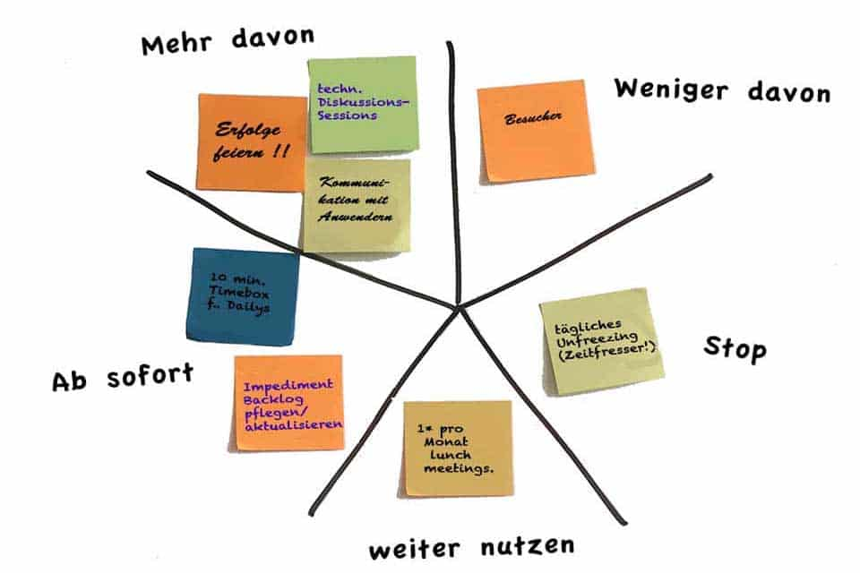

# Ablauf Sprint-Meeting

**Scrum-Master** leitet das Sprint-Meeting.

### 1. Review

*Scrum-Master zeigt **Slides** von der Präsentation.*
- :trollface: über das Meme lachen
- 🔥 Burndown erklären
- Jedes Teammitglied stellt sein [Review](review_presentation.md) vor

    ❓ **Fragen** sollen gestellt und alles **Erzählte** von **Allen** verstanden werden.

### 2. Retro

#### Retro Board
Auf dem Retro Board werden alle Post-Its von jedem gesammelt, welche zu vordefinierten Kategorien gehören. Diese Kategorien sollen grundsätzlich positives, negatives und Verbesserungen trennen. Siehe unten ein Beispiel.

Mögliche Kategorien:
*  \+ / - / stop / start
* :boat: Rücken-Wind, :anchor: Anker der einen gebremst hat, 🗿 Felsen im Weg die noch kommen, :desert_island: Inseldestination
> ...kann auch etwas anderes sein.

#### Ablauf

- 📜 Jeder für sich **Post-Its** schreiben oder 🖌️ zeichnen
- 📊 **Zusammentragen**, jeder stellt seine Punkte vor
- 💬 **Massnahmen** für Probleme besprechen
- 🚦**Impediment Log** mit Massnahmen erweitern und anpassen

### 3. Planning

*Scrum-Master zeigt das **Story-Board** in ZenHub.*

- 📥Stories in Sprint nehmen
    - vom letzten Sprint
    - vom Backlog
    - neu dazugekommene

- 💯 Punkte für jede Story **schätzen**
- 👥 Stories den Teammitgliedern **zuweisen**
> 🧘🏽 In ZenHub kann der **Status** zu `Spring Backlog` und entsprechenden **Milestone**, also Sprint, gesetzt werden. Weiter auch die geschätzten Punkte/Stunden und das zugewiesene Teammitglied.

> Alle Stories müssen eine saubere und klare Beschreibung haben, da anhand davon gearbeitet wird.

### Retro Board

