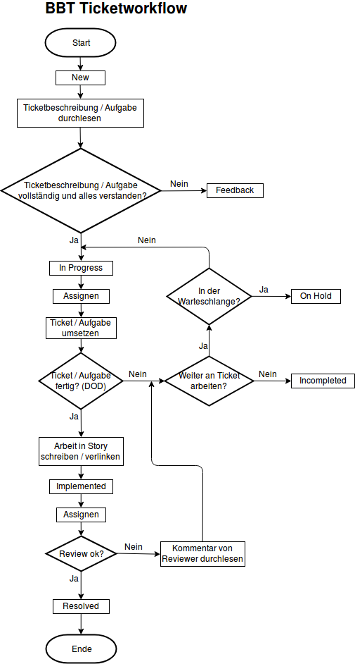
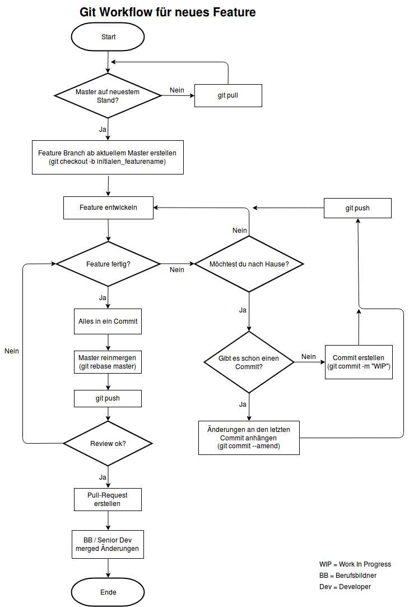

# Story

Ein :ticket: Ticket, oder eben Story, ist eine Aufgabe und repräsentiert meistens ein Feature oder :bug: Bug der Applikation.
Der **Ticket Workflow** zeigt, wie der Lebenszyklus eines Ticket aussieht und wie man eine Story abarbeitet. Wichtig dabei ist, wenn das Ticket implementiwert ist, soll die :heavy_check_mark: **DoD** (Definition of Done) durchgeackert werden. Der **Git Workflow** zeigt wir wir mit Git sauber arbeiten und an den wir uns stets halten.

Unsere Stories verwalten wir mittels [ZenHub](zenhub.md).

## Ticket Workflow

## Definition of Done
- Implementation
- Testabdeckung / Test durchführen
- Manual Testing
- Bestehende Daten prüfen
- Nicht mehr benötigter Code entfernen
- Git Workflow einhalten
- Update Lerndokumentation
- Update Projektdokumentation
- Spezifikationen korrekt durchlesen
- Assignen an Team für Review

## Git Workflow

