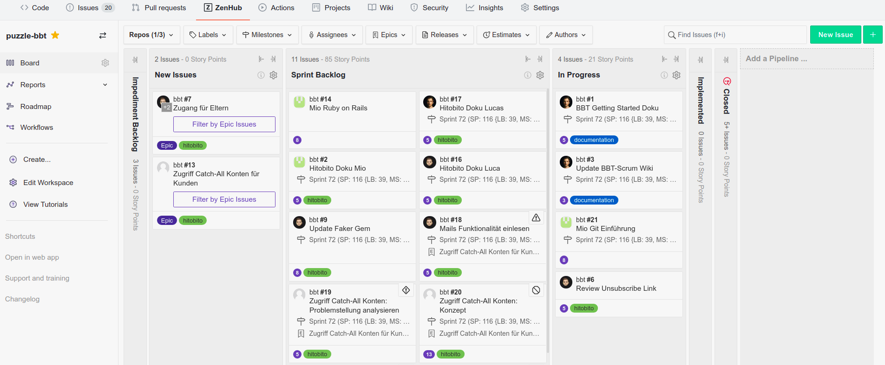
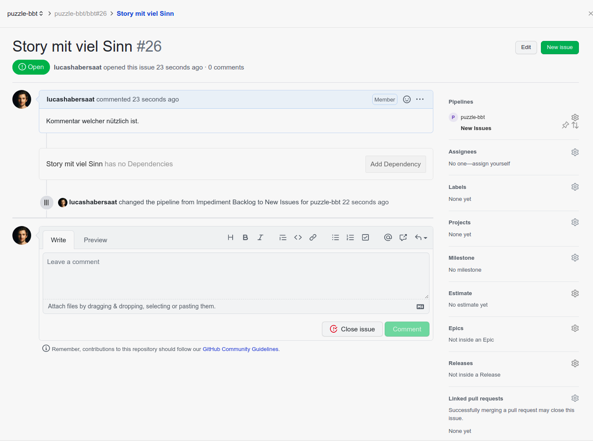

# ZenHub

Um Stories, Sprints und alles drumherum zu verwalten benutzen wir das Tool ZenHub. Das Tolle daran ist, es bietet integration in **GitHub** an und somit haben wir alles schön an einem Ort.

## Setup
Erstelle ein [ZenHub Account](https://app.zenhub.com/), am besten registrierst du dich gleich mit deinem GitHub Account. Danach solltest du auf [app.zenhub.com](https://app.zenhub.com/) alle Workspaces sehen, zu welchen du eingeladen wurdest.

Um ZenHub ideal zu nutzen, hole dir das [Browser Plugin](https://www.zenhub.com/extension), welches den ZenHub **Tab** in GitHub hinzufügt.

## Workspace & Repository

In ZenHub können Workspaces erstellt werden, zudenen die Teammitglieder eingeladen werden und zu welchen Repositories verknüpft sind. ([Repository?](https://blog.axosoft.com/learning-git-repository/#:~:text=Git%20is%20a%20program%20that%20tracks%20changes%20made%20to%20files.&text=A%20Git%20repository%20is%20the,building%20a%20history%20over%20time.)) In all diesen Repositories erscheint auch der ZenHub Tab. Jede Story soll dem zugehörigem Repo zugewiesen werden.

## Sprints oder Milestones

Unsere Sprints entsprechen Milestones im Workspace beziehungsweise in den Repositories. In der linken Leiste, kannst du Milestones mit Start und End-Datum erstellen. (Das geht nur im [ZenHub Webseite](https://app.zenhub.com/))

## Story Board

Das Story Board bietet alle Funktionen, die wir benötigen um unsere Stories zu managen. Es zeigt uns eine Übersicht aller Stories und ihren momentanen Status.
Stories (oder Issues, da Stories alle gleichzeitig Issues im Repo sind) können erstellt werden, herumgezogen werden um den Status zu ändern (In Progress, Implemented, ...) und vieles mehr.

## Story bearbeiten
Klick auf eine Story um sie zu bearbeiten. Bearbeite den Titel, Beschreibung oder füge einen Kommentar hinzu. Auf der Rechten Seite finden sich weitere Eigenschaften. Die wichtigen, welche immer aktuell gehalten werden sollen, sind folgende.

* Pipelines - Repository und Status (New Issue, In Progress, Implemented, ...)
* Assignee - zugewiesenes Teammitglied
* Milestone - der entsprechende Sprint
* Estimate - geschätzte Punkte/Stunden

